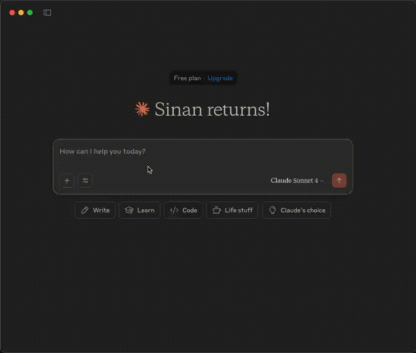

# OPET Fuel Prices MCP Server

A Model Context Protocol (MCP) server that provides access to OPET fuel prices data through Claude AI.

## Demo


## Features

- Get all available provinces
- Fetch fuel prices for specific provinces
- Get last update timestamp
- Error handling with detailed messages

## Prerequisites

Before using this MCP server, you need to set up the OPET API server first.

### 1. Install OPET Package

Install the OPET package from [https://github.com/sinanerdinc/opet](https://github.com/sinanerdinc/opet):

```bash
pip install opet
```

### 2. Start OPET API Server

Start the API server using one of the following methods:

**Option A: Using CLI**
```bash
opet-cli --api
```

**Option B: Using Docker**
```bash
docker run -p 8000:8000 sinanerdinc/opet api
```

**Option C: Using Docker with custom port**
```bash
docker run -p 5050:8000 sinanerdinc/opet api
```

The API server will be available at `http://localhost:8000` (or your custom port).

## Installation

### Prerequisites

- Python 3.12 or higher
- uv package manager (recommended) or pip
- OPET package installed and API server running

### Setup

1. Clone the repository:
```bash
git clone <repository-url>
cd opet-mcp
```

2. Using uv
```bash
# Install uv if you don't have it
curl -LsSf https://astral.sh/uv/install.sh | sh

# Create virtual environment and install dependencies
uv venv -p 3.12
source .venv/bin/activate  # On Windows: .venv\Scripts\activate
uv sync
```


## Configuration

Set the OPET API URL using environment variables. The URL should point to your running OPET API server:

```bash
# If using default port (8000)
export OPET_API_URL=http://localhost:8000

# If using custom port (e.g., 5050)
export OPET_API_URL=http://localhost:5050
```

## Usage

### Running the Server

Start the MCP server:

```bash
# With uv
uv run fastmcp run server.py

# With pip
fastmcp run server.py
```

### Example Configuration

#### Option 1: Install the server to Claude with a custom name and API URL:

```bash
{
  "mcpServers": {
    "Opet Server": {
      "command": "uv",
      "args": [
        "run",
        "--with",
        "fastmcp",
        "fastmcp",
        "run",
        "/your_absolute_path/opet-mcp/server.py"
      ],
      "env": {
        "OPET_API_URL": "http://localhost:8000"
      }
    }
  }
}
```

#### Option 2: Installation Command

```bash
fastmcp install server.py --name "OPET Fuel Prices" \
  --env-var OPET_API_URL=http://localhost:8000
```

## Available Tools

### get_all_provinces()
Retrieves a list of all provinces where fuel prices are available.

### get_fuel_prices_by_province(province_id)
Fetches current fuel prices for a specific province using its ID.

**Parameters:**
- `province_id` (str): The unique identifier of the province

### get_last_update_time()
Gets the timestamp of when the fuel prices were last updated in the system.

## License

This project is licensed under the MIT License - see the [LICENSE](LICENSE) file for details. 